# :material-school: Courses Learning Hub

A production-grade structured learning portal covering **DevOps, Cloud, Platform Engineering, MLOps, AIOps, and AI Engineering**.

These courses are built from **real-world enterprise experience**, hands-on production environments, interview preparation, and architecture patterns used in modern organizations.

Each course includes:

- Theory + practical concepts
- Production-grade examples
- Labs and hands-on exercises
- Interview preparation references
- Real-world projects
- Career roadmap guidance

---

## :material-map-marker-path: Recommended Learning Journey

```mermaid
graph LR
    A[Linux] --> B[Python]
    B --> C[Git & GitHub]
    C --> D[Docker]
    D --> E[Kubernetes]
    E --> F[Jenkins]
    F --> G[Terraform]
    G --> H[AWS / Azure]
    H --> I[DevOps Projects]
    I --> J[Machine Learning]
    J --> K[Data Science]
    K --> L[MLOps]
    L --> M[AIOps]
```

!!! tip "Start Here"

    New to DevOps? Begin with **Linux → Git → Python → Docker → Kubernetes**

    Already working in DevOps? Jump directly to **Terraform → Cloud → MLOps → AIOps**

    Preparing for interviews? Visit **Interview Prep** after completing each course.

# :material-hammer-wrench: DevOps & Infrastructure

-   :material-console-line: **Linux & Shell Scripting**

    **Level:** Beginner → Intermediate  
    **Duration:** ~20 Hours  
    **Topics:** CLI, file system, permissions, networking, shell scripting, performance tuning

    Linux is the foundation of DevOps. Learn command-line mastery and production server operations.

    [:octicons-arrow-right-24: Start Course](linux-shell.md)

-   :material-language-python: **Python for DevOps**

    **Level:** Beginner → Intermediate  
    **Duration:** ~25 Hours  
    **Topics:** Automation, APIs, Boto3, scripting, DevOps tooling

    Automate infrastructure, CI/CD workflows, cloud operations, and repetitive engineering tasks.

    [:octicons-arrow-right-24: Start Course](python-devops.md)

-   :fontawesome-brands-git-alt: **Git & GitHub**

    **Level:** Beginner  
    **Duration:** ~10 Hours  
    **Topics:** Git workflow, branching strategy, PRs, GitHub Actions, GitOps

    Version control everything properly using professional Git workflows.

    [:octicons-arrow-right-24: Start Course](git-github.md)

-   :simple-ansible: **Ansible**

    **Level:** Intermediate  
    **Duration:** ~15 Hours  
    **Topics:** Playbooks, roles, inventories, vault, automation patterns

    Configuration management and infrastructure automation for production systems.

    [:octicons-arrow-right-24: Start Course](ansible.md)

-   :material-docker: **Docker**

    **Level:** Beginner → Advanced  
    **Duration:** ~20 Hours  
    **Topics:** Containers, Dockerfile, Compose, security, production patterns

    Learn containerization from basics to enterprise-grade deployments.

    [:octicons-arrow-right-24: Start Course](docker.md)

-   :material-kubernetes: **Kubernetes**

    **Level:** Intermediate → Advanced  
    **Duration:** ~40 Hours  
    **Topics:** Architecture, workloads, networking, storage, RBAC, Helm, CKA

    The most important platform skill for modern DevOps and MLOps engineers.

    [:octicons-arrow-right-24: Start Course](kubernetes.md)

-   :simple-jenkins: **Jenkins**

    **Level:** Intermediate  
    **Duration:** ~15 Hours  
    **Topics:** Jenkinsfile, pipelines, shared libraries, integrations

    Build enterprise-grade CI/CD systems and deployment pipelines.

    [:octicons-arrow-right-24: Start Course](jenkins.md)

-   :material-terraform: **Terraform**

    **Level:** Intermediate → Advanced  
    **Duration:** ~20 Hours  
    **Topics:** IaC, state, modules, Terragrunt, testing, multi-cloud

    Provision cloud infrastructure using production-ready Infrastructure as Code.

    [:octicons-arrow-right-24: Start Course](terraform.md)

!!! tip "Start Here"

    New to DevOps? Begin with **Linux → Git → Python → Docker → Kubernetes**

    Already working in DevOps? Jump directly to **Terraform → Cloud → MLOps → AIOps**

    Preparing for interviews? Visit **Interview Prep** after completing each course.

# :material-hammer-wrench: DevOps & Infrastructure

-   :material-console-line: **Linux & Shell Scripting**

    **Level:** Beginner → Intermediate  
    **Duration:** ~20 Hours  
    **Topics:** CLI, file system, permissions, networking, shell scripting, performance tuning

    Linux is the foundation of DevOps. Learn command-line mastery and production server operations.

    [:octicons-arrow-right-24: Start Course](linux-shell.md)

-   :material-language-python: **Python for DevOps**

    **Level:** Beginner → Intermediate  
    **Duration:** ~25 Hours  
    **Topics:** Automation, APIs, Boto3, scripting, DevOps tooling

    Automate infrastructure, CI/CD workflows, cloud operations, and repetitive engineering tasks.

    [:octicons-arrow-right-24: Start Course](python-devops.md)

-   :fontawesome-brands-git-alt: **Git & GitHub**

    **Level:** Beginner  
    **Duration:** ~10 Hours  
    **Topics:** Git workflow, branching strategy, PRs, GitHub Actions, GitOps

    Version control everything properly using professional Git workflows.

    [:octicons-arrow-right-24: Start Course](git-github.md)

-   :simple-ansible: **Ansible**

    **Level:** Intermediate  
    **Duration:** ~15 Hours  
    **Topics:** Playbooks, roles, inventories, vault, automation patterns

    Configuration management and infrastructure automation for production systems.

    [:octicons-arrow-right-24: Start Course](ansible.md)

-   :material-docker: **Docker**

    **Level:** Beginner → Advanced  
    **Duration:** ~20 Hours  
    **Topics:** Containers, Dockerfile, Compose, security, production patterns

    Learn containerization from basics to enterprise-grade deployments.

    [:octicons-arrow-right-24: Start Course](docker.md)

-   :material-kubernetes: **Kubernetes**

    **Level:** Intermediate → Advanced  
    **Duration:** ~40 Hours  
    **Topics:** Architecture, workloads, networking, storage, RBAC, Helm, CKA

    The most important platform skill for modern DevOps and MLOps engineers.

    [:octicons-arrow-right-24: Start Course](kubernetes.md)

-   :simple-jenkins: **Jenkins**

    **Level:** Intermediate  
    **Duration:** ~15 Hours  
    **Topics:** Jenkinsfile, pipelines, shared libraries, integrations

    Build enterprise-grade CI/CD systems and deployment pipelines.

    [:octicons-arrow-right-24: Start Course](jenkins.md)

-   :material-terraform: **Terraform**

    **Level:** Intermediate → Advanced  
    **Duration:** ~20 Hours  
    **Topics:** IaC, state, modules, Terragrunt, testing, multi-cloud

    Provision cloud infrastructure using production-ready Infrastructure as Code.

    [:octicons-arrow-right-24: Start Course](terraform.md)

# :material-cloud: Cloud Platforms

-   :simple-amazonaws: **Amazon Web Services (AWS)**

    **Level:** Intermediate → Advanced  
    **Duration:** ~50 Hours  
    **Topics:** EC2, ECS, EKS, Lambda, VPC, IAM, RDS, cost optimization

    Complete production-focused AWS learning path for DevOps engineers.

    [:octicons-arrow-right-24: Start Course](aws.md)

-   :material-microsoft-azure: **Microsoft Azure**

    **Level:** Intermediate → Advanced  
    **Duration:** ~40 Hours  
    **Topics:** AKS, Azure DevOps, networking, identity, security

    Enterprise Azure learning path focused on platform engineering and MLOps.

    [:octicons-arrow-right-24: Start Course](azure.md)

# :material-brain: AI / ML Engineering

-   :material-chart-scatter-plot: **Machine Learning**

    **Level:** Beginner → Intermediate  
    **Duration:** ~30 Hours  
    **Topics:** ML fundamentals, model training, sklearn, deep learning basics

    Understand how models are trained before learning how to deploy them.

    [:octicons-arrow-right-24: Start Course](machine-learning.md)

-   :material-database-search: **Data Science**

    **Level:** Beginner → Intermediate  
    **Duration:** ~25 Hours  
    **Topics:** Pandas, NumPy, EDA, visualization, feature engineering

    Learn how data behaves before productionizing machine learning systems.

    [:octicons-arrow-right-24: Start Course](data-science.md)

-   :material-robot: **MLOps**

    **Level:** Advanced  
    **Duration:** ~45 Hours  
    **Topics:** ML pipelines, MLflow, Kubeflow, serving, monitoring, LLMOps

    The bridge between DevOps and Machine Learning production systems.

    [:octicons-arrow-right-24: Start Course](mlops.md)

-   :material-robot-industrial: **AIOps**

    **Level:** Advanced  
    **Duration:** ~20 Hours  
    **Topics:** anomaly detection, predictive alerting, AI monitoring, incident automation

    AI-driven operations and intelligent infrastructure management.

    [:octicons-arrow-right-24: Start Course](aiops.md)

# :material-format-list-checks: Course Status Overview

| Course | Level | Current Status |
|---|---|---|
| Linux | Beginner | :material-check-circle:{ style="color:#2bbc8a" } Complete |
| Python for DevOps | Beginner | :material-clock-outline:{ style="color:#e5a50a" } In Progress |
| Git & GitHub | Beginner | :material-check-circle:{ style="color:#2bbc8a" } Complete |
| Ansible | Intermediate | :material-check-circle:{ style="color:#2bbc8a" } Complete |
| Docker | Intermediate | :material-check-circle:{ style="color:#2bbc8a" } Complete |
| Kubernetes | Advanced | :material-clock-outline:{ style="color:#e5a50a" } In Progress |
| Jenkins | Intermediate | :material-check-circle:{ style="color:#2bbc8a" } Complete |
| Terraform | Advanced | :material-check-circle:{ style="color:#2bbc8a" } Complete |
| AWS | Advanced | :material-clock-outline:{ style="color:#e5a50a" } In Progress |
| Azure | Advanced | :material-pencil-outline:{ style="color:#94a3b8" } Planned |
| ML | Intermediate | :material-pencil-outline:{ style="color:#94a3b8" } Planned |
| Data Science | Intermediate | :material-pencil-outline:{ style="color:#94a3b8" } Planned |
| MLOps | Advanced | :material-clock-outline:{ style="color:#e5a50a" } In Progress |
| AIOps | Advanced | :material-clock-outline:{ style="color:#e5a50a" } In Progress |

# :material-school-outline: Suggested Learning Paths

=== "New to DevOps"

    1. Linux  
    2. Git & GitHub  
    3. Python for DevOps  
    4. Docker  
    5. Kubernetes  
    6. Jenkins  
    7. Terraform  
    8. AWS

=== "DevOps → MLOps"

    1. Docker  
    2. Kubernetes  
    3. Machine Learning  
    4. Data Science  
    5. MLOps  
    6. AIOps

=== "Certification Focus"

    - **CKA** → Kubernetes + Kubernetes Labs  
    - **AWS SAA-C03** → AWS + Terraform Labs  
    - **Terraform Associate** → Terraform + Real Labs  
    - **Azure AZ-400** → Azure + Azure DevOps + AKS

=== "Interview Preparation"

    Complete each course first, then move to:

    → [Interview Preparation](../interview-prep/index.md)

    This includes:

    - Senior DevOps Interview Q&A  
    - MLOps System Design  
    - SRE Interview Preparation  
    - Cloud Architecture Interviews

!!! success "Professional Strategy"

    Learn → Practice → Document → Record → Publish → Portfolio

    This is the fastest path to becoming highly valuable in DevOps + MLOps engineering.

    Your learning should always create:

    - skills  
    - public proof  
    - interview confidence  
    - company-ready portfolio