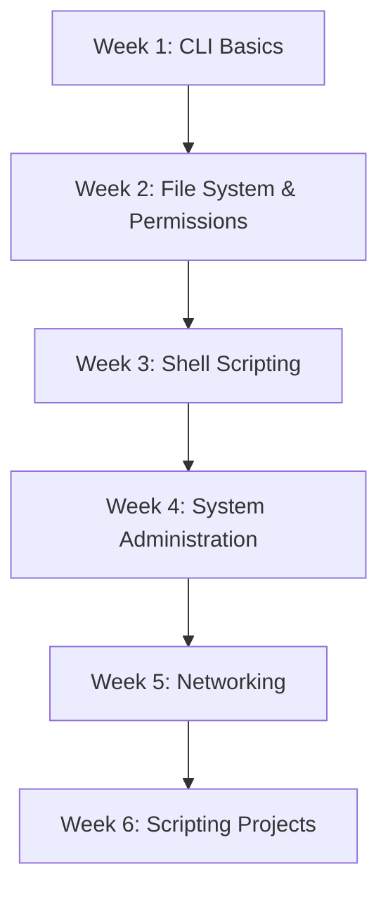

# :material-console-line: Linux & Shell Scripting

> **The foundation of every DevOps engineer.** If you can't navigate and control Linux, nothing else in this stack will make sense.

-   :material-clock-outline: **~20 hours**
-   :material-signal: **Beginner → Intermediate**
-   :material-video: **YouTube Series Available**
-   :material-update: **Updated: 2026**

---

## :material-information: Course Overview

Linux powers over 96% of the world's servers, cloud infrastructure, and container runtimes. This course covers everything from basic command-line navigation to advanced scripting, process management, and system hardening — all from a DevOps engineer's perspective.

**What you'll be able to do after this course:**

- Navigate and manage Linux systems confidently
- Write production-grade bash scripts for automation
- Manage users, permissions, and system services
- Troubleshoot system performance issues
- Understand networking from a Linux perspective

---

## :material-list-box: Topics Covered

=== "Foundations"
    - Linux distributions and architecture
    - Filesystem hierarchy standard (FHS)
    - Essential commands: `ls`, `cd`, `cp`, `mv`, `rm`, `find`, `grep`
    - File permissions and ownership (`chmod`, `chown`)
    - Text processing: `awk`, `sed`, `cut`, `sort`, `uniq`
    - Redirections, pipes, and I/O streams

=== "Scripting"
    - Bash scripting fundamentals
    - Variables, arrays, and functions
    - Control flow: `if`, `for`, `while`, `case`
    - Error handling and exit codes
    - Script debugging with `set -x`
    - Cron jobs and task scheduling
    - Environment variables and `.bashrc`/`.bash_profile`

=== "System Admin"
    - Process management: `ps`, `top`, `htop`, `kill`
    - Service management with `systemd`
    - Package management: `apt`, `yum`, `dnf`
    - Disk management: `df`, `du`, `fdisk`, `lsblk`
    - User and group management
    - SSH configuration and key-based auth
    - Log management: `journalctl`, `/var/log/`

=== "Networking"
    - Network interfaces and IP configuration
    - DNS resolution and `/etc/hosts`
    - Firewall with `ufw` / `firewalld`
    - Port scanning with `netstat`, `ss`, `nmap`
    - `curl`, `wget`, and HTTP from the CLI
    - File transfer: `scp`, `rsync`

=== "Security"
    - sudo and privilege escalation
    - SSH hardening
    - File system encryption
    - SELinux and AppArmor basics
    - Audit logging

---

## :material-map-marker-path: Learning Path

---

## :material-youtube: YouTube Playlist

| # | Video | Duration |
|---|---|---|
| 01 | Introduction to Linux for DevOps | 45 min |
| 02 | Linux Filesystem & Essential Commands | 60 min |
| 03 | File Permissions Deep Dive | 45 min |
| 04 | Text Processing with AWK & SED | 90 min |
| 05 | Bash Scripting from Zero | 120 min |
| 06 | Advanced Bash: Functions & Error Handling | 90 min |
| 07 | Systemd & Service Management | 60 min |
| 08 | SSH & Secure Remote Access | 60 min |
| 09 | Networking Fundamentals for DevOps | 75 min |
| 10 | Real-World Automation Scripts | 90 min |

[:fontawesome-brands-youtube: Watch Full Playlist](https://youtube.com/@senvishal02){ .md-button .md-button--primary }

---

## :material-test-tube: Hands-On Labs

- [Lab 1: Setting Up a Linux Dev Environment](../../labs/docker-labs/index.md)
- [Lab 2: Automate Backup with Bash Scripts](../../labs/docker-labs/index.md)
- [Lab 3: User Management Automation](../../labs/docker-labs/index.md)
- [Lab 4: System Monitoring Script](../../labs/docker-labs/index.md)

---

## :material-lightning-bolt: Quick Reference

[:material-lightning-bolt: Linux Cheatsheet](../../cheatsheets/linux.md){ .md-button }
[:material-help-circle: Linux Interview Q&A](../../interview-prep/devops/index.md){ .md-button }

---

## :fontawesome-brands-github: GitHub Resources

- Source code and scripts for all exercises
- Solution files for every lab
- Project templates

[:fontawesome-brands-github: View on GitHub](https://github.com/senvishal02/courses){ .md-button }

---

!!! note "Prerequisites"
    No prior Linux experience required. Basic computer usage is sufficient.

!!! tip "Pro Tip"
    Set up a Linux VM (using VirtualBox or Multipass) and practice every command as you learn it. Don't just read — type it.